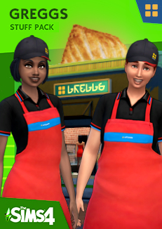

# Sims 4: Unofficial Greggs Stuff Pack

This is a work-in-progress stuff pack to make your very own [UK based bakery chain Greggs](https://www.greggs.co.uk/) in the Sims.

This is not endorsed by Greggs at all, but if they want to give me a lifetime supply of vegan sausage rolls they are more than welcome too.

## What is included?

### CAS

- **Uniform**: Full Body - Apron, in feminine and masculine versions
- **Cap**: Hat

### Build mode

_Search for 'greggs'_

- **Greggs sign**: Signage for your Greggs

## Game Requirements

Base game.

## Credits/Thanks

- These items are reskins of the apron and cap in the base game.
- Gregg's logo made with the [Nootrasim Simlish font by Franzilla](https://www.modthesims.info/download.php?t=584840)
- Thanks to Anna for feedback and testing

## Planned additions

- Sausage rolls (with vegan variant)
- Bakes (with vegan variant)
- Coffee/tea to go cups
- More posters/propaganda
- Various Greggs clutter
